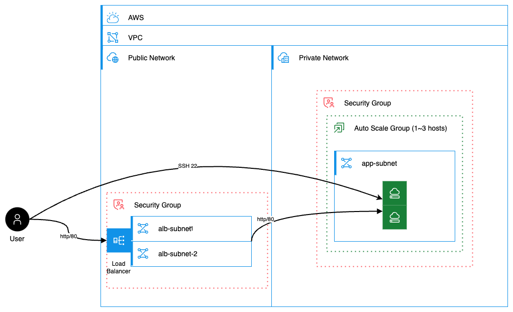
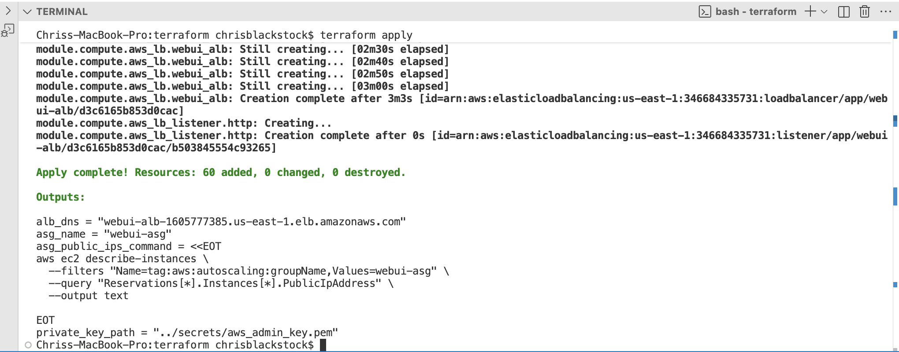
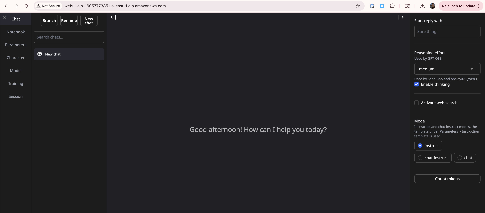

# Introduction

This repository contains terraform and ansible code that deploys an instance of the open-source AI platform [Open Webui](https://openwebui.com) in AWS.

The infrustracture contians:

- A VPC
- A regionally available autoscaling group of EC2 instances to host the service
- A load balancer to front the ALG
- Security groups configured for least access
- Dedicated SSH certificates for the instances spawned by the
- terraform state hosted in s3
- A CICD pipline that is triggered on commits to this repository (WIP)

# Deploy Instructions

- Clone this repository `git clone git@github.com:MD4HASH/portfolio.git`
- [Install terraform](https://developer.hashicorp.com/terraform/tutorials/aws-get-started/install-cli)
- [Install AWS CLI](https://docs.aws.amazon.com/cli/latest/userguide/getting-started-install.html)
- navigate to `/terraform/models/prerequisites` and run `terraform init`, `terraform plan`, `terraform apply`
  - This deploys prerequisites for s3-backed terraform state and the cicd
  - This will also output the bucket name to be used for terraform state, which will be required for the next step
- navigate to `/terraform` and run `terraform init`, `terraform plan`, `terraform apply`
- This will deploy the rest of the infrastructure
- The ASG contains a cloud-init script that will bootstrap the installation of ansible, clone this respository, and run the playbook located in `/ansible`, which installs and configured Open Webui.
- The terraform output will include the url of the loadbalancer, put this in your web browser and ensure that you specify `http` (planned improivement)

